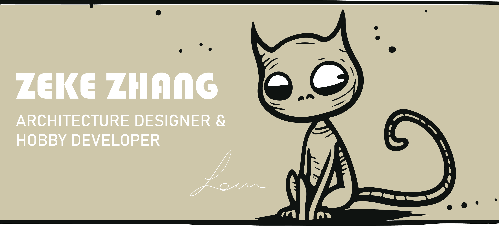

# 🌍Greetings, fellow earthlings!

### I am Zeke,
a self-conscious creature who was hatched🥚 in China but later migrated to Australia for bigger and better opportunities. I am currently pursuing my Master's degree in architecture, specializing in the mind-boggling world of advanced computational design🧑‍💻. When I'm not designing structures that defy the laws of physics, I'm tinkering away on my computer, writing code that will one day take over the world (just kidding... or am I?🤖). 

I love sharing my creations with others and spreading the joy of programming. But what really gets my tail wagging is the idea of using cutting-edge computational generative design to embrace indigenous culture and traditions. So, there you have it - a glimpse into the life of a quirky, design-obsessed, code-loving creature!

Skills: GRASSHOPPER / PYTHON / C#

<picture>
<source 
  srcset="https://github-readme-stats.vercel.app/api?username=sean1832&show_icons=true"
  media="(prefers-color-scheme: light), (prefers-color-scheme: no-preference)"
/>

</picture>

